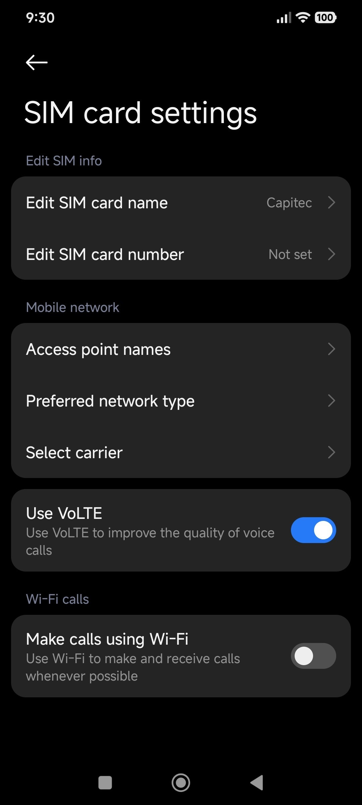
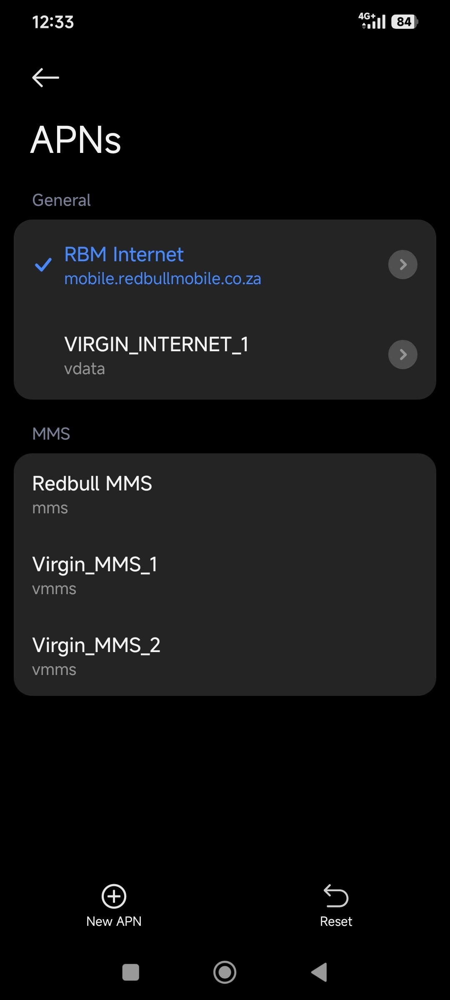
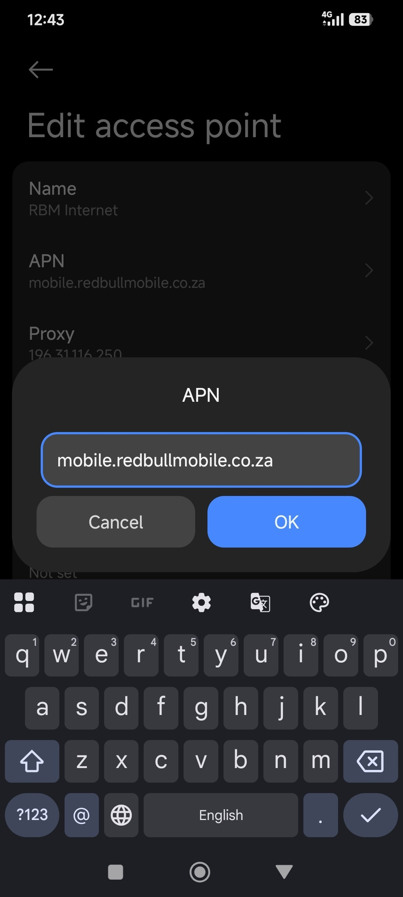

# Mobile Connectivity Investigation

**Project Type: IT Support / Network Troubleshooting Case Study**

## Overview

This project documents a real-world mobile connectivity incident involving a Capitec Connect SIM after a successful number port. The objective was to identify why mobile data was unavailable despite having network signal and an active data bundle.

This case study demonstrates basic troubleshooting, problem-solving, and technical documentation.

## Incident Summary

| **Item** | **Details** |
|---|---|
| **Device** | Xiaomi Redmi Note 14 |
| **Network** | Capitec Connect |
| **Issue** | Mobile data not working after number port |
| **Status** | Resolved through APN reconfiguration and systematic troubleshooting |

## Problem

- Mobile data was not working.
- Websites were only loaded when 3G was selected.

## Troubleshooting Process

### Step 1: Followed the Number Port Process & Verified SIM Activation

I completed the Capitec Connect number port process as instructed and waited for the port to complete successfully.

I then verified that:

- The SIM activation and number-porting process had been completed successfully.
- The device displayed the Capitec Connect network.
- Network registration was verified with a Capitec Connect support agent.
- Voice calls were functioning.
- Mobile signal was present.

**Result:** SIM activation and network registration confirmed.

#### Mobile Network Settings

### Step 2: Tested Connectivity

I performed multiple tests to isolate the issue.

| **Test** | **Result** |
|---|---|
| Mobile signal | PASS |
| Voice calls | PASS |
| Data bundle active | PASS |
| Web browsing | FAIL |

### Step 3: Checked APN Configuration

I inspected the Access Point Name (APN) settings on the device.

**Finding:**

The device contained an APN profile labelled "Red Bull Mobile Internet" (RBM Internet), which appeared to be outdated for the current network.

#### RBM Internet APN

**Testing:**

I tested the existing APN with different network options to determine whether the APN or network type was affecting the connection.

**Test 1:**

- Selected 3G under Preferred Network Type.
- Selected the RBM Internet APN.

**Result:** Mobile data worked.

**Test 2:**

- Selected LTE under Preferred Network Type.
- Selected the RBM Internet APN.

**Result:** Mobile data did not work.

I then reset the APN settings to default to check whether additional or different APN options would become available.

**Result:** The available APN options remained the same.

**Next Steps:**

- Added a new APN manually using the appropriate settings for the network.
- Selected the new APN.
- Tested the mobile data connection.

#### Remove Outdated APN

**Result:** 4G/LTE mobile data started working again.

## Finding

After the number port was completed, the Xiaomi Redmi Note 14 automatically used an APN profile labelled "Red Bull Mobile Internet" (RBM Internet).

I did not add this APN manually; it was already selected on the device after the SIM was set up. I cannot confirm whether this is the default APN for all Capitec Connect users or devices, but this was the APN automatically selected on my device.

## Root Cause

Based on my testing, the existing APN configuration was not working correctly with 4G/LTE on the device.

## Resolution

I reset the APN settings to check whether different options would become available, but the same APN options remained.

I then added a new APN manually using the appropriate settings, selected it, and tested the connection.

**Result:** 4G/LTE mobile data started working again.

## Skills Demonstrated

- Basic troubleshooting
- APN configuration
- Problem solving
- Following troubleshooting steps
- Technical documentation

## Lessons Learned

- A successful network connection does not always mean that mobile data is working correctly.
- APN settings can affect mobile-data connectivity.
- Testing different services, such as calls and web browsing, can help identify where a connectivity problem is occurring.
